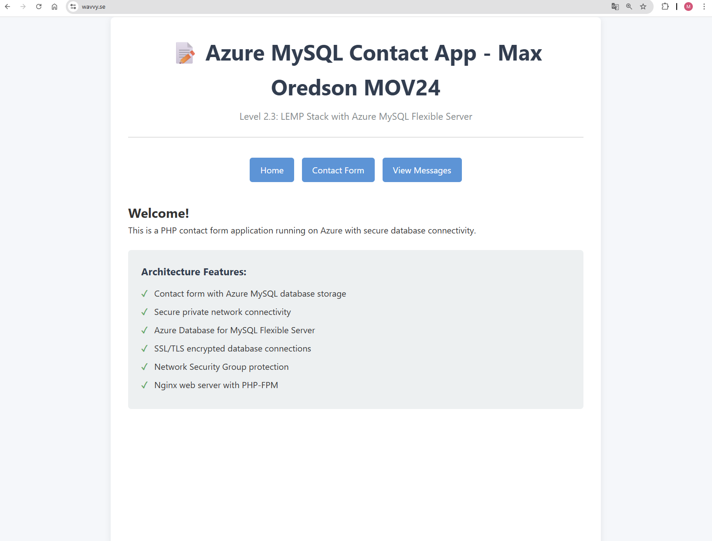

# 🌐 Modern Webapp med Bastionhost, Reverse Proxy och Automatiserad CI/CD

Detta är en enkel men robust webbapplikation som inkluderar ett kontaktformulär för användarinteraktion. Applikationen är hostad på en Ubuntu-baserad virtuell server i Azure och skyddas av en bastionhost för säker fjärråtkomst. En reverse proxy används för att hantera och dirigera inkommande trafik, vilket förbättrar både prestanda och säkerhet. Data från kontaktformuläret lagras tryggt i Azure Blob Storage.

Infrastrukturen bygger på flera virtuella servrar: en bastionhost som möjliggör säker administration, en reverse proxy som fungerar som trafikhanterare, samt applikationsservern där webbapplikationen körs. Denna arkitektur säkerställer en välstrukturerad och säker driftmiljö.

<p align="center">
  https://wavvy.se
</p>



---

# Infrastrukturuppsättning i Azure

För att strukturera projektets infrastruktur på ett säkert och skalbart sätt har jag inledningsvis skapat en resursgrupp vid namn **rg-webapp-mysql.** Denna resursgrupp fungerar som en samlad plats för alla relaterade resurser inom projektet.

Därefter konfigurerades ett virtuellt nätverk med namnet **vnet-webapp-mysql**, vilket är baserat på adressrymden **10.0.0.0/16.** Detta nätverk är indelat i flera undernät (subnets), där varje del har ett tydligt syfte och ansvar för olika komponenter i lösningen:

| Subnät                | Adressrymd    | Syfte                                                                                                                         |
| --------------------- | ------------- | ----------------------------------------------------------------------------------------------------------------------------- |
| `app-subnet`          | `10.0.1.0/24` | Här placeras applikationsservern som kör webbapplikationen.                                                                   |
| `db-subnet`           | `10.0.2.0/24` | Används för att isolera MySQL-databasen i en separat zon.                                                                     |
| `reverseproxy-subnet` | `10.0.3.0/24` | Innehåller en reverse proxy-server som hanterar trafik mellan klient och applikation.                                         |
| `bastionhost-subnet`  | `10.0.4.0/24` | Innehåller en Bastion Host som möjliggör säker administration (SSH) utan att exponera virtuella maskiner direkt mot internet. |

Denna uppdelning av nätverket möjliggör förbättrad säkerhet, enklare nätverksadministration och tydligare separering mellan olika typer av resurser.

# Säkerhetsfördelar med nätverksarkitekturen

Genom att segmentera det virtuella nätverket i dedikerade subnät för olika funktioner uppnås flera viktiga säkerhetsfördelar:

- 🔐 **Nätverksisolering:** Databasen ligger i ett separat db-subnet utan direkt exponering mot internet, vilket minimerar risken för intrång.
- 🔁 **Trafikstyrning och filtrering:** Med ett separat reverseproxy-subnet kan inkommande trafik kontrolleras och filtreras innan den når applikationen. Detta möjliggör implementation av t.ex. brandväggsregler, TLS-terminering och lastbalansering.
- 👨‍💻 **Säker administration:** Genom att använda en Bastion Host i ett eget bastionhost-subnet undviks behovet av att öppna portar för SSH direkt mot de virtuella maskinerna. All åtkomst sker via Azure Bastion, vilket erbjuder en säker och spårbar inloggningsmetod.

# Applikationsserver (VM)

Efter att nätverksinfrastrukturen var på plats skapades en virtuell maskin som fungerar som applikationsserver. Denna server är ansvarig för att köra webbapplikationen samt ansluta till databasen via LEMP-stacken (Linux, Nginx, MySQL, PHP).

**Konfiguration av virtuell maskin:**

| Parameter             | Värde                                                 |
| --------------------- | ----------------------------------------------------- |
| **Namn**              | `vm-webapp`                                           |
| **Region**            | North Europe                                          |
| **Image**             | Ubuntu Server 22.04 LTS – x64 Gen2                    |
| **Storlek**           | Standard\_B1s (kostnadseffektiv för utbildningssyfte) |
| **Virtuellt nätverk** | `vnet-webapp-mysql`                                   |
| **Subnet**            | `app-subnet` (`10.0.1.0/24`)                          |

För automatiserad installation och konfiguration av programvaran användes en cloud-init-fil. Denna fil ser till att alla nödvändiga komponenter för applikationsdrift installeras och konfigureras vid uppstart. Cloud-init-konfigurationen är bifogad längst ner i rapporten.

## 🖥️ Applikationsserver (Appserver)

**Operativsystem:** Ubuntu 24.04 LTS
- Kör webbapplikationen (PHP, MySQL-anslutningar etc.)
- Ansvarar för kommunikation med databasen (MySQL)
- Tar emot och behandlar trafik från reverse proxy-servern
- Hanterar användarsessioner och autentisering

# Reverse proxy-server (VM)

Efter att applikationsservern var på plats skapades en virtuell maskin som fungerar som reverse proxy-server. Denna server ansvarar för att ta emot och hantera alla inkommande HTTP/HTTPS-förfrågningar, vidarebefordra dem till backend-webbservern, samt förbättra säkerheten genom att agera som en barriär mellan internet och interna resurser. Reverse proxy-servern hanterar också SSL-terminering, lastbalansering och kan bidra till att optimera prestanda genom cachning. Reverse Proxy-konfigurationen är bifogad längst ner i rapporten.

**Konfiguration av virtuell maskin**

| **Parameter**         | Värde                                                 |
| --------------------- | ----------------------------------------------------- |
| **Namn**              | `vm-reverseproxy`                                     |
| **Region**            | North Europe                                          |
| **Image**             | Ubuntu Server 22.04 LTS – x64 Gen2                    |
| **Storlek**           | Standard\_B1s (kostnadseffektiv för utbildningssyfte) |
| **Virtuellt nätverk** | `vnet-webapp-mysql`                                   |
| **Subnet**            | `reverseproxy-subnet (10.0.3.0/24)`                   |

## 🖥️ Reverse Proxy-server

**Operativsystem**: Ubuntu 24.04 LTS
- Tar emot och hanterar alla inkommande HTTP/HTTPS-förfrågningar
- Utför SSL-terminering med hjälp av Let's Encrypt-certifikat
- Proxyar och vidarebefordrar trafik till applikationsservern på interna IP-adresser
- Förbättrar säkerheten genom att agera som en barriär och begränsa direkt åtkomst till applikationsservern

# Bastion-host server (VM)

Efter att både applikationsservern och reverse proxy-servern var på plats skapades en virtuell maskin som fungerar som bastion-host. Denna server ansvarar för att ge säker fjärråtkomst till resurser i det privata nätverket, utan att exponera dem direkt mot internet. Bastion-host fungerar som en säker gateway för administration, och minskar risken för obehörig åtkomst genom att centralisera och skydda anslutningarna.

**Konfiguration av virtuell maskin**

| **Parameter**         | Värde                                                 |
| --------------------- | ----------------------------------------------------- |
| **Namn**              | `vm-bastion-host`                                     |
| **Region**            | North Europe                                          |
| **Image**             | Ubuntu Server 22.04 LTS – x64 Gen2                    |
| **Storlek**           | Standard\_B1s (kostnadseffektiv för utbildningssyfte) |
| **Virtuellt nätverk** | `vnet-webapp-mysql`                                   |
| **Subnet**            | `bastion-subnet (10.0.4.0/24)`                        |

## 🖥️ Bastion Host (Säker SSH-access)

- Ger säker fjärråtkomst till resurser i det privata nätverket
- Fungerar som en säker gateway för SSH-anslutningar till interna servrar
- Används som hopppunkt (ProxyJump) vid fjärradministration och i CI/CD-pipelines
- Centraliserar och begränsar åtkomst för att minska risken för obehörig åtkomst
- Skyddar interna servrar genom att undvika direkt exponering mot internet


# Databaskonfiguration: Azure Database for MySQL – Flexible Server

För att hantera lagring och hantering av applikationens databas skapades en **Azure Database for MySQL – Flexible Server.** Denna tjänst är optimerad för utvecklingsmiljöer och erbjuder hög tillgänglighet, automatiska säkerhetskopior samt flexibel resurshantering.

| Parameter                  | Värde                                               |
| -------------------------- | --------------------------------------------------- |
| **Servernamn**             | `mysql-webapp-01`                                   |
| **Region**                 | North Europe                                        |
| **MySQL-version**          | 5.7                                                 |
| **Arbetsbelastning**       | Development (optimerad för test och utveckling)     |
| **Beräkning + lagring**    | Burstable B1ms (1 vCore, 2 GiB RAM), 20 GiB lagring |
| **Anslutningstyp**         | Privat anslutning via VNet-integration              |
| **Virtuellt nätverk**      | `vnet-webapp-mysql`                                 |
| **Subnet**                 | `db-subnet` (`10.0.2.0/24`)                         |
| **Privat DNS-integration** | Ja                                                  |
| **Privat DNS-zon**         | `mysql.database.azure.com`                          |

## 🖥️ Databasserver (Azure Database for MySQL)

- Lagrar applikationens strukturerade data (formulärsvar, användarinformation m.m.)
- Körs som hanterad tjänst för enklare drift och underhåll
- Ansluts privat via VNet för ökad säkerhet
- Ger automatisk backup och hög tillgänglighet
- Optimerad för utvecklingsmiljö med flexibel resursanvändning

# Applikationsfiler och deras funktion

För att bygga webbapplikationen skapades ett antal viktiga filer, vilka utgör applikationens backend, frontend och stil. Nedan följer en översikt av varje fil och dess syfte:

| Filnamn               | Syfte                                                                                                |
| --------------------- | ---------------------------------------------------------------------------------------------------- |
| `database_setup.php`  | Skript för att skapa och konfigurera databastabeller som används av applikationen.                   |
| `index.html`          | Startsidan för webbapplikationen som visar användarens namn och grundläggande information.           |
| `contact_form.html`   | HTML-formulär där användare kan skicka in kontaktmeddelanden.                                        |
| `on_post_contact.php` | Backend-skript som hanterar formulärdata (POST) från `contact_form.html` och sparar det i databasen. |
| `on_get_messages.php` | Backend-skript som hämtar och returnerar sparade meddelanden från databasen (GET).                   |
| `style.css`           | CSS-fil som innehåller stilmallarna för webbapplikationens visuella utseende.                        |

**Sammanfattning**

Tillsammans utgör dessa filer en komplett webbapplikation med både frontend och backend som möjliggör insamling, lagring och visning av användarinmatad data, samtidigt som användarupplevelsen förstärks med en separat stilfil.

## 🧰 Funktionalitet

- ✅ Visar startsida (`index.html`)
- ✅ Kontaktformulär (via `contact_form.html`)
- ✅ Skickar formulärdata till backend (`on_post_contact.php`)
- ✅ Visar sparade meddelanden (`on_get_messages.php`)
- ✅ PHP-script för databas-setup (`database_setup.php`)
- ✅ Responsiv design via `style.css`
- ✅ Lagrar formulärsvar i Azure Blob Storage

---

# ☁️ Infrastruktur, Säkerhet & Deployment

Denna webbapplikation är byggd med fokus på säkerhet, skalbarhet och effektiv hantering av driftsättningar. Infrastrukturmiljön består av flera virtuella servrar i Azure, där en dedikerad bastionhost möjliggör säker fjärråtkomst, och en reverse proxy hanterar inkommande trafik för att optimera prestanda och skydd. Applikationen körs på en separat virtuell server som är isolerad för att garantera stabilitet och säkerhet.

Deploymentprocessen är automatiserad via en CI/CD-pipeline som säkerställer snabba, pålitliga och reproducerbara leveranser till produktionsmiljön. Detta möjliggör kontinuerliga uppdateringar av applikationen utan driftstopp och med hög kvalitet i varje release.

## 📁 Mappstruktur

/webapp

├── contact_form.html

├── database_setup.php

├── index.html

├── on_get_messages.php

├── on_post_contact.php

└── style.css

## ☁️ Azure Blob Storage

- Lagrar formulärdata och bifogade filer från webbapplikationen
- Formulärsvar sparas som .json-fil i Blob Storage
- Svaren lagras i en container som heter **responses**
- Separat lagring utanför applikationsservern för bättre skalbarhet och säkerhet
- Åtkomst sker via API-anrop från applikationen

## 🔐 Säkerhet

- ✅ Endast bastion host är öppen mot internet
- ✅ Applikationsservern är endast tillgänglig via bastionen (SSH ProxyJump)
- ✅ SSH-nycklar hanteras säkert via GitHub Secrets
- ✅ Automatisk uppdatering av serverns known_hosts via pipeline
- ✅ Brandvägg tillåter endast nödvändig trafik (t.ex. HTTPS via reverse proxy)
- ✅ TLS/HTTPS används med giltiga certifikat på reverse proxy

## 🔒 Network Security Groups (NSG)

| **NSG-namn**          | **Tillämpat på**      | **Port(ar)**           | **Användning / Syfte**                                                                                                                                                                                                                 |
| --------------------- | --------------------- | ---------------------- | -------------------------------------------------------------------------------------------------------------------------------------------------------------------------------------------------------------------------------------- |
| `nsg-db-subnet`       | Databassubnet         | 3306 (MySQL)           | Tillåter MySQL-trafik från webbapplikationens subnet **10.0.1.0/24** till databasen                                                                                                                                                    |
| `vm-bastionhost-nsg`  | Bastion Host VM       | 22 (SSH)               | Tillåter SSH-åtkomst till bastionhost                                                                                                                                                                                                  |
| `vm-reverseproxy-nsg` | Reverse Proxy VM      | 80 (HTTP), 443 (HTTPS) | Tillåter kontrollerad HTTP/HTTPS-trafik från internet till reverse proxy för att säkert exponera webbapplikationen                                                                                                                     |
| `webapp-nsg`          | Applikationsserver VM | 80 (HTTP), 22 (SSH)    | ASG\:erna `ReverseProxyASG` (HTTP/HTTPS) och `BastionHostASG` (SSH) används som destination i NSG-regler för att tillåta trafik från reverse proxyn respektive bastionhost till webbapplikationen, som inte är exponerad mot internet. |

## 🔒 Application Security Groups (ASG)

| **ASG-namn**      | **Tillämpat på** | **Användning / Syfte**                                                                                               |
| ----------------- | ---------------- | -------------------------------------------------------------------------------------------------------------------- |
| `ReverseProxyASG` | Reverse Proxy VM | Används som **destination** i NSG-regel för att tillåta HTTP/HTTPS-trafik till webbapplikationen från reverse proxyn |
| `BastionHostASG`  | Bastion Host VM  | Används som **destination** i NSG-regel för att tillåta SSH-trafik till webbapplikationen från bastionhost           |


## 🔐 GitHub Secrets

Nedan visas en översikt över de miljövariabler och hemligheter som används för att ansluta till bastionhost och applikationsservern. Värdena inkluderar både publika och interna IP-adresser, användarnamn samt referens till den privata SSH-nyckeln.

| **Namn**          | **Värde**                           | **Beskrivning**                     |
| ----------------- | ----------------------------------- | ----------------------------------- |
| `BASTION_HOST`    | `74.234.34.18`                      | Publik IP till bastionhost          |
| `BASTION_USER`    | `azureuser`                         | Användare för bastionhost           |
| `SSH_PRIVATE_KEY` | privat SSH-nyckel (`~/.ssh/id_rsa`) | Privat SSH-nyckel för autentisering |
| `VM_HOST`         | `10.0.1.4`                          | Intern IP till applikationsserver   |
| `VM_USER`         | `azureuser`                         | Användare för applikationsserver    |


## 🔐 Hantering av SSH-nycklar

För att möjliggöra säker och automatiserad deployment från GitHub Actions till webbservern används SSH-nyckelbaserad autentisering:
- Ett nyckelpar (privat + publik) genereras lokalt
- Den privata nyckeln (id_rsa) läggs till som en GitHub Secret i repositoryt (SSH_PRIVATE_KEY)
- Den publika nyckeln (id_rsa.pub) läggs till i filen ~/.ssh/authorized_keys på:
  - Bastion Host
  - Appservern

GitHub Actions använder sedan nyckeln för att ansluta till servern via SSH och köra deployment-kommandon (t.ex. git pull)

## 🔒 HTTPS och SSL/TLS-säkerhet

Applikationen är säkrad med HTTPS via ett kostnadsfritt SSL/TLS-certifikat från **Let's Encrypt**. Certifikatet hanteras automatiskt med hjälp av **Certbot**, och installationen sker direkt på reverse proxy-servern (Nginx).

**Funktionaliteten bygger på följande:**

- **Port 443** är öppen på reverse proxy-servern för att tillåta HTTPS-trafik.
- **Domänen (`wavvy.se`) pekar till reverse proxy-serverns IP** via A-poster i DNS (Loopia).
- **Certbot** används för att automatiskt:
  - Generera och installera SSL-certifikat
  - Förnya certifikaten regelbundet
- **Nginx** är konfigurerad att lyssna på både port 80 och 443, och omdirigerar trafik från HTTP till HTTPS.

**Därmed säkerställs:**
- Krypterad kommunikation mellan klient och server
- Skydd mot man-in-the-middle-attacker
- Förbättrad SEO och användarförtroende

Exempel på tillgänglig tjänst:
https://wavvy.se


## 🚀 CI/CD-pipeline med GitHub Actions

Applikationen använder en CI/CD-pipeline (Continuous Integration & Continuous Deployment) via GitHub Actions för att automatiskt:

- Bygga och testa kod
- Ansluta till webbservern via SSH genom en bastion host och reverse proxy
- Utföra git pull för att hämta senaste versionen av koden till servern
- Köra eventuella byggsteg (t.ex. php-fpm install, composer install, etc.)
- Starta om applikationen vid behov (t.ex. nginx)
- Verifiera och hantera miljövariabler och hemligheter via GitHub Secrets

## 🛠️ Processflöde

- När en ändring pushas till main-branchen startas arbetsflödet automatiskt.
- En GitHub Actions-runner sätter upp en säker SSH-anslutning till bastion host och vidare via reverse proxy till webbservern.
- På målsystemet hämtas den senaste koden.
- Tjänsten startas om så att ändringarna blir synliga direkt.

## 🔐 Säkerhet i pipelinen

- SSH-nycklar hanteras säkert via GitHub Secrets
- ProxyJump (bastion host) används för säker åtkomst till interna miljöer
- Endast privata nycklar används (lösenordsfri autentisering)
- HTTPS är aktiverat på webbservern via Let's Encrypt och Nginx

# Bilagor till koder som tillhör webbapplikationen

Här hittar du samlade kodbilagor och konfigurationsfiler som hör till webbapplikationen. Dessa filer utgör viktiga delar av applikationens backend och servermiljö, och visar bland annat hur servern är uppsatt, hur databasen ansluts samt hur applikationen hanterar data.

## 📄 cloud-config.yaml
Denna fil används för att automatisera installationen och konfigureringen av LEMP-stacken (Linux, Nginx, MySQL-klient, PHP) på applikationsservern. Genom att använda denna cloud-config säkerställs att servern är korrekt förberedd med alla nödvändiga komponenter för att köra webbapplikationen.

```yaml
#cloud-config
# Application server with LEMP stack for Azure MySQL connectivity

package_update: true

# Add external repositories
apt:
  sources:
    ondrej-php:
      source: ppa:ondrej/php

packages:
  - software-properties-common  # Required for adding PPAs
  - nginx          # Web server
  - php8.1-fpm     # PHP 8.1 FastCGI Process Manager (specific version)
  - php8.1-mysql   # PHP 8.1 MySQL extension
  - php8.1-cli     # PHP 8.1 command line interface
  - mysql-client   # MySQL client for testing
  - unzip          # For extracting files

write_files:
  # Configure Nginx to serve PHP files
  - path: /etc/nginx/sites-available/default
    content: |
      server {
          listen 80;
          root /var/www/html;
          index index.php index.html index.nginx-debian.html;

          server_name _;

          location / {
              try_files $uri $uri/ =404;
          }

          location ~ \.php$ {
              include snippets/fastcgi-php.conf;
              fastcgi_pass unix:/var/run/php/php8.1-fpm.sock;
          }

          # Health check endpoint
          location /health {
              access_log off;
              return 200 "Application server healthy\n";
              add_header Content-Type text/plain;
          }
      }

runcmd:
  # Set proper permissions for web directory
  - chown -R www-data:www-data /var/www/html
  - chmod -R 755 /var/www/html

  # Restart and enable services
  - systemctl restart nginx
  - systemctl enable nginx
  - systemctl restart php8.1-fpm
  - systemctl enable php8.1-fpm
```

  ## 📄 database_setup.php
  Denna fil ansluter till Azure MySQL med säker SSL-anslutning och skapar tabellen contacts om den inte redan finns. Den används för att konfigurera databasen som webbapplikationen behöver.

```php
<?php
// Azure MySQL Database configuration
// Replace with your actual Azure MySQL server details
// CI/CD Pipeline
$host = getenv('MYSQL_HOST') ?: 'mysql-webapp-01.mysql.database.azure.com';
$dbname = getenv('MYSQL_DATABASE') ?: 'contactforms';
$username = getenv('MYSQL_USERNAME') ?: 'mysqladmin';
$password = getenv('MYSQL_PASSWORD') ?: 'SecurePassword123!';

try {
    // Connect to Azure MySQL with SSL
    $pdo = new PDO("mysql:host=$host;dbname=$dbname;charset=utf8mb4", $username, $password, [
        PDO::ATTR_ERRMODE => PDO::ERRMODE_EXCEPTION,
        PDO::ATTR_DEFAULT_FETCH_MODE => PDO::FETCH_ASSOC,
        PDO::MYSQL_ATTR_SSL_CA => '/etc/ssl/certs/ca-certificates.crt'
    ]);

    // Create table if not exists (database-first approach for learning)
    $pdo->exec("CREATE TABLE IF NOT EXISTS contacts (
        id INT AUTO_INCREMENT PRIMARY KEY,
        name VARCHAR(100) NOT NULL,
        email VARCHAR(100) NOT NULL,
        message TEXT NOT NULL,
        created_at TIMESTAMP DEFAULT CURRENT_TIMESTAMP,
        INDEX idx_created_at (created_at)
    )");

    echo "<!-- Database connection successful -->\n";

} catch(PDOException $e) {
    // Log error and show user-friendly message
    error_log("Database connection failed: " . $e->getMessage());
    die("Database connection failed. Please check configuration. Error: " . $e->getMessage());
}
?>
``` 

## 📄 index.html
Startsidan för webbapplikationen som presenterar kontaktappens syfte och arkitektur. Den innehåller navigering till formulär och meddelandelista samt ger en översikt över tekniska funktioner.

```html
<!-- CI/CD Pipeline -->
<!DOCTYPE html>
<html lang="en">
<head>
    <meta charset="UTF-8">
    <meta name="viewport" content="width=device-width, initial-scale=1.0">
    <title>Level 2.3: Azure MySQL Contact App</title>
    <link rel="stylesheet" href="style.css">
</head>
<body>
    <div class="container">
        <header>
            <h1>📝 Azure MySQL Contact App - Max Oredson MOV24</h1>
            <p>Level 2.3: LEMP Stack with Azure MySQL Flexible Server</p>
        </header>

        <nav>
            <a href="index.html" class="btn">Home</a>
            <a href="contact_form.html" class="btn">Contact Form</a>
            <a href="on_get_messages.php" class="btn">View Messages</a>
        </nav>

        <main>
            <h2>Welcome!</h2>
            <p>This is a PHP contact form application running on Azure with secure database connectivity.</p>

            <div class="features">
                <h3>Architecture Features:</h3>
                <ul>
                    <li>Contact form with Azure MySQL database storage</li>
                    <li>Secure private network connectivity</li>
                    <li>Azure Database for MySQL Flexible Server</li>
                    <li>SSL/TLS encrypted database connections</li>
                    <li>Network Security Group protection</li>
                    <li>Nginx web server with PHP-FPM</li>
                </ul>
            </div>
        </main>
    </div>
</body>
</html>
```
## 📄 contact_form.html
En webbsida med ett kontaktformulär där användare kan skicka namn, e-post och meddelande. Formuläret skickar data till servern för vidare hantering.

```html
<!-- CI/CD Pipeline -->
<!DOCTYPE html>
<html lang="en">
<head>
    <meta charset="UTF-8">
    <meta name="viewport" content="width=device-width, initial-scale=1.0">
    <title>Contact Form - Azure MySQL Contact App</title>
    <link rel="stylesheet" href="style.css">
</head>
<body>
    <div class="container">
        <header>
            <h1>✉️ Contact Form</h1>
        </header>

        <nav>
            <a href="index.html" class="btn">Home</a>
            <a href="contact_form.html" class="btn active">Contact Form</a>
            <a href="on_get_messages.php" class="btn">View Messages</a>
        </nav>

        <main>
            <form action="on_post_contact.php" method="POST" class="contact-form">
                <div class="form-group">
                    <label for="name">Name:</label>
                    <input type="text" id="name" name="name" required>
                </div>

                <div class="form-group">
                    <label for="email">Email:</label>
                    <input type="email" id="email" name="email" required>
                </div>

                <div class="form-group">
                    <label for="message">Message:</label>
                    <textarea id="message" name="message" rows="5" required></textarea>
                </div>

                <button type="submit" class="btn submit-btn">Send Message</button>
            </form>
        </main>
    </div>
</body>
</html>
```

## 📄 on_post_contact.php
Denna fil tar emot och bearbetar data från kontaktformuläret. Den validerar inmatningen och sparar meddelandet i Azure MySQL-databasen samt lagrar en kopia i Azure Blob Storage.

```php
<?php
// CI/CD Pipeline

if (!defined('CURLOPT_SSLVERSION')) {
    define('CURLOPT_SSLVERSION', 32);
}
if (!defined('CURL_SSLVERSION_TLSv1_2')) {
    define('CURL_SSLVERSION_TLSv1_2', 6);
}

// Handle POST request for contact form submission
require_once 'database_setup.php';
require_once 'vendor/autoload.php'; // Azure SDK

use MicrosoftAzure\Storage\Blob\BlobRestProxy;
use MicrosoftAzure\Storage\Common\Exceptions\ServiceException;
use MicrosoftAzure\Storage\Blob\Models\CreateBlockBlobOptions;

if ($_SERVER['REQUEST_METHOD'] == 'POST') {
    $name = $_POST['name'] ?? '';
    $email = $_POST['email'] ?? '';
    $message = $_POST['message'] ?? '';

    if (!empty($name) && !empty($email) && !empty($message)) {
        try {
            // === 1. Spara i databasen (din befintliga kod) ===
            $stmt = $pdo->prepare("INSERT INTO contacts (name, email, message) VALUES (?, ?, ?)");
            $stmt->execute([$name, $email, $message]);
            $success = true;

            // === 2. Skapa JSON av formulärsvar ===
            $formData = [
                'name' => $name,
                'email' => $email,
                'message' => $message,
                'timestamp' => date('c')
            ];
            $jsonData = json_encode($formData, JSON_PRETTY_PRINT);
            $filename = 'formulärsvar_' . time() . '_' . uniqid() . '.json';

            // === 3. Azure Blob Storage setup ===
            $connectionString = "DefaultEndpointsProtocol=https;AccountName=blobresponses;AccountKey=bW4S5o6DgnNef09ZZsCDE3Q/gDMx04Z+J/J0xVBGdUIObcbOgvPt0utrvx6V8ejaMUxTn1UbWCO8+AStJc4ubA==;EndpointSuffix=core.windows.net";
            $containerName = 'responses';

            $blobClient = BlobRestProxy::createBlobService($connectionString);
            $options = new CreateBlockBlobOptions();
            $options->setContentType("application/json");

            // === 4. Spara JSON som blob ===
            $blobClient->createBlockBlob($containerName, $filename, $jsonData, $options);

        } catch (PDOException $e) {
            $error = "Error saving message: " . $e->getMessage();
        } catch (ServiceException $e) {
            $error = "Error saving to blob storage: " . $e->getMessage();
        }
    } else {
        $error = "All fields are required.";
    }
}
?>
<!DOCTYPE html>
<html lang="en">
<head>
    <meta charset="UTF-8">
    <meta name="viewport" content="width=device-width, initial-scale=1.0">
    <title>Message Sent - Azure MySQL Contact App</title>
    <link rel="stylesheet" href="style.css">
</head>
<body>
    <div class="container">
        <header>
            <h1>📨 Message Status</h1>
        </header>

        <nav>
            <a href="index.html" class="btn">Home</a>
            <a href="contact_form.html" class="btn">Contact Form</a>
            <a href="on_get_messages.php" class="btn">View Messages</a>
        </nav>

        <main>
            <?php if (isset($success)): ?>
                <div class="success-message">
                    <h2>✅ Message Sent Successfully!</h2>
                    <p>Thank you for your message. It has been saved to both the Azure MySQL database and Azure Blob Storage.</p>
                </div>
            <?php elseif (isset($error)): ?>
                <div class="error-message">
                    <h2>❌ Error</h2>
                    <p><?php echo htmlspecialchars($error); ?></p>
                </div>
            <?php endif; ?>

            <div class="actions">
                <a href="contact_form.html" class="btn">Send Another Message</a>
                <a href="on_get_messages.php" class="btn">View All Messages</a>
            </div>
        </main>
    </div>
</body>
</html>
```

## 📄 on_get_messages.php
Denna fil hämtar och visar alla inskickade kontaktmeddelanden från Azure MySQL-databasen.

```php
<?php
// CI/CD Pipeline
// Handle GET request to display all contact messages
require_once 'database_setup.php';

try {
    $stmt = $pdo->prepare("SELECT id, name, email, message, created_at FROM contacts ORDER BY created_at DESC");
    $stmt->execute();
    $messages = $stmt->fetchAll(PDO::FETCH_ASSOC);
} catch(PDOException $e) {
    $error = "Error retrieving messages: " . $e->getMessage();
    $messages = [];
}
?>
<!DOCTYPE html>
<html lang="en">
<head>
    <meta charset="UTF-8">
    <meta name="viewport" content="width=device-width, initial-scale=1.0">
    <title>All Messages - Azure MySQL Contact App</title>
    <link rel="stylesheet" href="style.css">
</head>
<body>
    <div class="container">
        <header>
            <h1>📋 All Messages</h1>
        </header>

        <nav>
            <a href="index.html" class="btn">Home</a>
            <a href="contact_form.html" class="btn">Contact Form</a>
            <a href="on_get_messages.php" class="btn active">View Messages</a>
        </nav>

        <main>
            <?php if (isset($error)): ?>
                <div class="error-message">
                    <h2>❌ Error</h2>
                    <p><?php echo htmlspecialchars($error); ?></p>
                </div>
            <?php elseif (empty($messages)): ?>
                <div class="info-message">
                    <h2>📭 No Messages Yet</h2>
                    <p>No messages have been submitted yet.</p>
                    <a href="contact_form.html" class="btn">Send First Message</a>
                </div>
            <?php else: ?>
                <div class="messages-count">
                    <p>Total messages: <strong><?php echo count($messages); ?></strong></p>
                </div>

                <div class="messages-list">
                    <?php foreach ($messages as $message): ?>
                        <div class="message-item">
                            <div class="message-header">
                                <h3><?php echo htmlspecialchars($message['name']); ?></h3>
                                <span class="message-date"><?php echo htmlspecialchars($message['created_at']); ?></span>
                            </div>
                            <p class="message-email">📧 <?php echo htmlspecialchars($message['email']); ?></p>
                            <div class="message-content">
                                <p><?php echo nl2br(htmlspecialchars($message['message'])); ?></p>
                            </div>
                        </div>
                    <?php endforeach; ?>
                </div>
            <?php endif; ?>
        </main>
    </div>
</body>
</html>
```

## 📄 style.css
Denna fil innehåller enkel och ren styling för webbapplikationen, inklusive layout, färger, knappar, formulär och responsiv design för bättre användarupplevelse på olika enheter.

```css
/* 🌐 Modern CSS for Contact Webapp - CI/CD Pipeline Ready */

/* Reset & Base Styles */
* {
  margin: 0;
  padding: 0;
  box-sizing: border-box;
}

body {
  font-family: 'Segoe UI', Tahoma, Geneva, Verdana, sans-serif;
  background-color: #f5f7fa;
  color: #333;
  line-height: 1.6;
}

.container {
  max-width: 900px;
  margin: auto;
  padding: 2rem;
  background-color: #fff;
  box-shadow: 0 2px 12px rgba(0, 0, 0, 0.08);
  border-radius: 8px;
  min-height: 100vh;
}

/* Header */
header {
  text-align: center;
  margin-bottom: 2rem;
  border-bottom: 2px solid #e0e0e0;
  padding-bottom: 1.5rem;
}

header h1 {
  color: #2c3e50;
  font-size: 2.5rem;
  margin-bottom: 0.5rem;
}

header p {
  color: #7f8c8d;
  font-size: 1.1rem;
}

/* Navigation */
nav {
  text-align: center;
  margin-bottom: 2rem;
}

.btn {
  display: inline-block;
  padding: 0.6rem 1.2rem;
  margin: 0.3rem;
  font-size: 1rem;
  border-radius: 5px;
  text-decoration: none;
  border: none;
  cursor: pointer;
  background-color: #3498db;
  color: #fff;
  transition: background-color 0.3s ease;
}

.btn:hover {
  background-color: #2980b9;
}

.btn.active {
  background-color: #2c3e50;
}

.btn.submit-btn {
  background-color: #27ae60;
  width: 100%;
  margin-top: 1rem;
}

.btn.submit-btn:hover {
  background-color: #219150;
}

/* Main Content */
main {
  margin-bottom: 2rem;
}

/* Features Section */
.features {
  background-color: #ecf0f1;
  padding: 1.5rem;
  border-radius: 6px;
  margin-top: 1.5rem;
}

.features h3 {
  color: #2c3e50;
  margin-bottom: 0.75rem;
}

.features ul {
  list-style: none;
  padding-left: 0;
}

.features li {
  position: relative;
  padding-left: 1.5rem;
  margin-bottom: 0.5rem;
}

.features li::before {
  content: "✓";
  position: absolute;
  left: 0;
  color: #27ae60;
  font-weight: bold;
}

/* Contact Form */
.contact-form {
  background-color: #f8f9fa;
  padding: 2rem;
  border-radius: 8px;
  border: 1px solid #dee2e6;
}

.form-group {
  margin-bottom: 1.5rem;
}

.form-group label {
  display: block;
  margin-bottom: 0.5rem;
  font-weight: 600;
  color: #2c3e50;
}

.form-group input,
.form-group textarea {
  width: 100%;
  padding: 0.75rem;
  border: 1px solid #ced4da;
  border-radius: 4px;
  font-size: 1rem;
  transition: border-color 0.2s ease;
}

.form-group input:focus,
.form-group textarea:focus {
  border-color: #3498db;
  outline: none;
  box-shadow: 0 0 5px rgba(52, 152, 219, 0.3);
}

/* System Messages */
.success-message,
.error-message,
.info-message {
  padding: 1rem;
  margin: 1.5rem 0;
  border-radius: 5px;
  text-align: center;
  font-weight: 500;
}

.success-message {
  background-color: #d4edda;
  color: #155724;
  border: 1px solid #c3e6cb;
}

.error-message {
  background-color: #f8d7da;
  color: #721c24;
  border: 1px solid #f5c6cb;
}

.info-message {
  background-color: #d1ecf1;
  color: #0c5460;
  border: 1px solid #bee5eb;
}

.actions {
  text-align: center;
  margin-top: 1.5rem;
}

/* Message List */
.messages-count {
  background-color: #e8f4fd;
  padding: 0.75rem;
  border-radius: 5px;
  margin-bottom: 1.5rem;
  text-align: center;
  font-weight: 500;
}

.messages-list {
  display: flex;
  flex-direction: column;
  gap: 1.25rem;
}

.message-item {
  background-color: #f8f9fa;
  border: 1px solid #e9ecef;
  border-radius: 8px;
  padding: 1.25rem;
}

.message-header {
  display: flex;
  justify-content: space-between;
  align-items: center;
  margin-bottom: 0.75rem;
  border-bottom: 1px solid #eee;
  padding-bottom: 0.5rem;
}

.message-header h3 {
  color: #2c3e50;
  margin: 0;
  font-size: 1.2rem;
}

.message-date {
  color: #7f8c8d;
  font-size: 0.9rem;
}

.message-email {
  color: #3498db;
  margin-bottom: 0.5rem;
}

.message-content {
  color: #555;
}

.message-content p {
  margin: 0;
}

/* Responsive Design */
@media (max-width: 600px) {
  .container {
    padding: 1rem;
  }

  .message-header {
    flex-direction: column;
    align-items: flex-start;
  }

  .message-date {
    margin-top: 0.5rem;
  }

  .btn {
    padding: 0.5rem 1rem;
    font-size: 0.9rem;
  }
}
```

## 📄 Reverse Proxy-konfiguration
**/etc/nginx/sites-available/default** är Nginx-konfigurationsfilen som används för att ställa in reverse proxy på din server. Den definierar hur inkommande HTTP-förfrågningar tas emot och vidarebefordras till backend-applikationer eller servrar, vilket gör att Nginx agerar som en mellanhand som hanterar trafik och säkerställer smidig kommunikation mellan klient och applikation.

```bash
server {
  server_name wavvy.se www.wavvy.se;  # <-- Sätt din domän här

  location / {
    proxy_pass         http://10.0.1.4:80/;
    proxy_http_version 1.1;

    proxy_set_header   Upgrade $http_upgrade;
    proxy_set_header   Connection "upgrade";
    proxy_set_header   Host $host;
    proxy_cache_bypass $http_upgrade;

    proxy_set_header   X-Forwarded-For $proxy_add_x_forwarded_for;
    proxy_set_header   X-Forwarded-Proto $scheme;
  }

    listen 443 ssl; # managed by Certbot
    ssl_certificate /etc/letsencrypt/live/wavvy.se/fullchain.pem; # managed by Certbot
    ssl_certificate_key /etc/letsencrypt/live/wavvy.se/privkey.pem; # managed by Certbot
    include /etc/letsencrypt/options-ssl-nginx.conf; # managed by Certbot
    ssl_dhparam /etc/letsencrypt/ssl-dhparams.pem; # managed by Certbot

}

server {
    if ($host = wavvy.se) {
        return 301 https://$host$request_uri;
    } # managed by Certbot


  listen 80 default_server;
  server_name wavvy.se www.wavvy.se;
    return 404; # managed by Certbot


}
